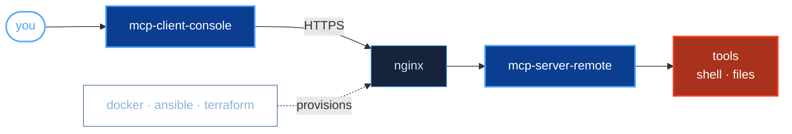

### *Geospatial Data Engineer*
*Building and deploying AI-integrated systems on AWS*

**GIS, AWS, FME, CAD, Python, Linux, ETL pipelines, MCP, LLM agentic workflows.**

*...how it all fits together:*

**Packages live on [PyPI](https://pypi.org/)** 
*...install with `pipx` and launch as apps straight from CLI!*

[`mcp-server-remote`](https://pypi.org/project/mcp-server-remote/)
[`mcp-client-console`](https://pypi.org/project/mcp-client-console/)

**Stacks accessible on [GitHub](https://github.com/)** 
*...designed for IaC deployment via `terraform`*

[`mcp-sandbox-setup`](https://github.com/geomux/mcp-sandbox-setup)
[`mcp-host-configuration`](https://github.com/geomux/mcp-host-configuration)
[`mcp-host-provision`](https://github.com/geomux/mcp-host-provision)

[`terraform-backend`](https://github.com/geomux/terraform-backend)
