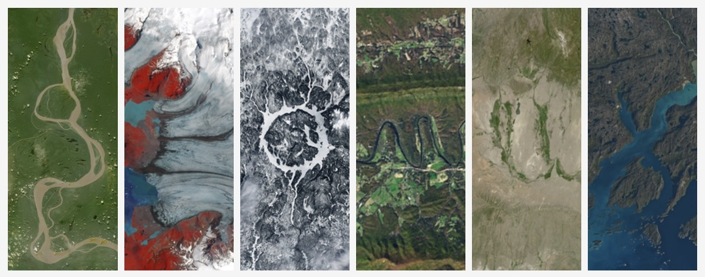

### *Geospatial Data Engineer*

**GIS, AWS, FME, CAD, Python, Linux, ETL pipelines, MCP, LLM agentic workflows.**

**Packages live on [PyPI](https://pypi.org/)** 
*...install with `pipx` and launch as apps straight from CLI!*

[`mcp-server-remote`](https://pypi.org/project/mcp-server-remote/)
[`mcp-client-console`](https://pypi.org/project/mcp-client-console/)

**Stacks accessible on [GitHub](https://github.com/)** 
*...designed for IaC deployment via Terraform*

[`mcp-sandbox-setup`](https://github.com/geomux/mcp-sandbox-setup)
[`mcp-host-setup`](https://github.com/geomux/mcp-host-setup)

