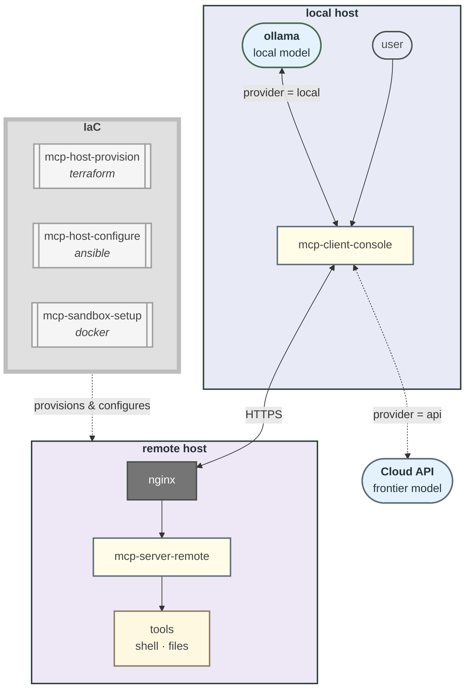

## *Geospatial Data Engineer*
*Building and deploying AI-integrated systems on AWS*

### **AWS • MCP • LLM agentic workflows • Python • Linux**
*Deploying with - Terraform • Ansible • Docker*
*Geospatial foundation - GIS • FME • CAD • spatial ETL pipelines*

> [!NOTE]
> Currently building MCP server/client systems and IaC stacks to deploy them.

**The agentic AI tooling cloud deployed system**
*...a local CLI client, a remote MCP server, and the IaC that deploys it*

**Packages live on [PyPI](https://pypi.org/user/geomux/)** 
*...install with `pipx` and launch as apps straight from CLI!*

[`mcp-server-remote`](https://pypi.org/project/mcp-server-remote/)
[`mcp-client-console`](https://pypi.org/project/mcp-client-console/)

**Stacks accessible on [GitHub](https://github.com/geomux)** 
*...designed for IaC deployment via `terraform` `ansible` `docker`*

[`mcp-sandbox-setup`](https://github.com/geomux/mcp-sandbox-setup)
[`mcp-host-configure`](https://github.com/geomux/mcp-host-configure)
[`mcp-host-provision`](https://github.com/geomux/mcp-host-provision)

[`terraform-backend`](https://github.com/geomux/terraform-backend)

