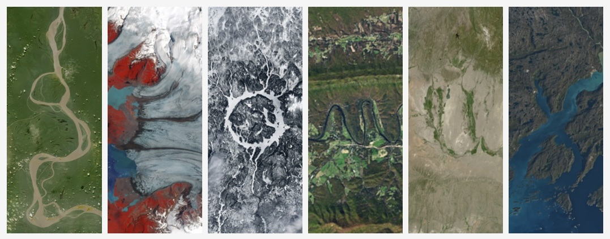

## *Bringing Agentic Tool Calling to Production Environments*
*Building and Deploying AI-Integrated Systems on AWS*

> <ins>*Building in</ins> - AWS • MCP • LLM agentic workflows • Python • Linux*

> <ins>*Deploying with</ins> - Terraform • Ansible • Docker*

> <ins>*GIS foundation</ins> - Python geoprocessing • ETL pipelines • system automation*

Currently building MCP server/client systems for agentic tool calling and IaC stacks to deploy them.

**<ins>Agentic AI tooling, cloud-deployed</ins>**

%%{init: {"flowchart": {"defaultRenderer": "elk", "nodeSpacing": 22, "rankSpacing": 38, "padding": 6}}}%%
flowchart LR
    subgraph IAC["`**IaC**`"]
        P[["`mcp-host-provision
*terraform*`"]]:::iac
        CF[["`mcp-host-configure
*ansible*`"]]:::iac
        SB[["`mcp-sandbox-setup
*docker*`"]]:::iac
        TFS[["`tf-state-backend
*terraform*`"]]:::iac
        SB ~~~ P
        TFS ~~~ CF
    end

    subgraph LHOST["`**local host**`"]
        U(["`user`"]):::me --> C["`mcp-client-console`"]:::pkg
        M(["`**ollama**
local model`"]):::model <-->|provider = local| C
    end

    subgraph RHOST["`**remote host**`"]
        N["`nginx`"]:::plumb --> S["`mcp-server-remote`"]:::pkg --> T["`tools
shell · files`"]:::tools
    end

    API(["`**Cloud API**
frontier model`"]):::cloud

    C <-->|HTTPS| N
    C <-.->|provider = api| API
    P -.->|provisions & configures| RHOST

    classDef me fill:none,stroke:#4A4F4A,stroke-width:2px,color:#4A4F4A
    classDef pkg fill:#FFFDE7,stroke:#5A6B7A,stroke-width:2px,color:#424242
    classDef plumb fill:#757575,stroke:#4A4F4A,stroke-width:2px,color:#FFFFFF
    classDef tools fill:#FFF8E1,stroke:#8A7A60,stroke-width:2px,color:#424242
    classDef iac fill:#F5F5F5,stroke:#9E9E9E,stroke-width:2px,color:#424242
    classDef model fill:#E3F2FD,stroke:#476B50,stroke-width:2px,color:#263238
    classDef cloud fill:#E3F2FD,stroke:#5A6B7A,stroke-width:2px,color:#263238
    style RHOST fill:#EDE7F6,stroke:#2E4034,stroke-width:2px,color:#263238
    style LHOST fill:#E8EAF6,stroke:#2E4034,stroke-width:2px,color:#263238
    style IAC fill:#E0E0E0,stroke:#BDBDBD,stroke-width:6px,color:#424242

**Packages live on [PyPI](https://pypi.org/user/geomux/)** 
*...install with `pipx` and launch as apps straight from CLI!*

[`mcp-server-remote`](https://pypi.org/project/mcp-server-remote/)
[`mcp-client-console`](https://pypi.org/project/mcp-client-console/)

**Stacks accessible on [GitHub](https://github.com/geomux)** 
*...designed for IaC deployment via `terraform`•`ansible`•`docker`*

[`mcp-sandbox-setup`](https://github.com/geomux/mcp-sandbox-setup)
[`mcp-sandbox-pentest`](https://github.com/geomux/mcp-sandbox-pentest)
[`mcp-host-configure`](https://github.com/geomux/mcp-host-configure)
[`mcp-host-provision`](https://github.com/geomux/mcp-host-provision)

[`tf-state-backend`](https://github.com/geomux/tf-state-backend)

